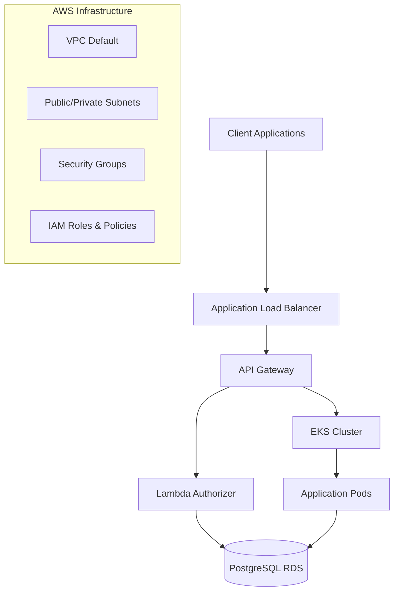

# 🏗️ Infra K8s Terraform

Repositório de infraestrutura como código para provisionamento e gerenciamento de clusters Kubernetes na AWS usando Terraform. Este projeto implementa uma arquitetura completa incluindo clusters EKS, API Gateway, Lambda Authorizers e toda a infraestrutura de suporte necessária.

## 🏛️ Arquitetura

O projeto implementa uma arquitetura serverless e containerizada na AWS:



### Componentes Principais

- **EKS Cluster**: Orquestração de containers com Kubernetes
- **API Gateway**: Gerenciamento de APIs e roteamento
- **Lambda Authorizer**: Autenticação e autorização serverless
- **PostgreSQL RDS**: Banco de dados relacional
- **VPC & Networking**: Isolamento e conectividade de rede

## 📁 Estrutura do Repositório

```
infra-k8s-terraform/
├── 📄 main.tf                        # Configuração Terraform principal
├── 📄 variables.tf                   # Variáveis globais do projeto
├── 📄 outputs.tf                     # Outputs dos recursos criados
├── 📄 providers.tf                   # Configuração de providers AWS
├── 📄 backend.tf                     # Configuração do state remoto
├── 📄 run-tests.sh                   # Script de execução de testes
├── 📁 .github/workflows/             # CI/CD Pipelines
│   ├── gateway-tests.yml            # Pipeline de testes do Gateway
│   └── terraform-apply.yml          # Pipeline de deploy da infraestrutura
├── 📁 modules/                       # Módulos Terraform
│   ├── eks/                         # Módulo do cluster EKS
│   │   ├── main.tf                  # Configuração do cluster
│   │   ├── variables.tf             # Variáveis do EKS
│   │   └── outputs.tf               # Outputs do cluster
│   └── gateway/                     # Módulo do API Gateway
│       ├── gateway.tf               # Recursos do Gateway
│       ├── variables.tf             # Variáveis do Gateway
│       └── authorizer/              # Lambda Authorizer
│           ├── 📦 package.json      # Dependências Node.js
│           ├── 🔧 jest.config.js    # Configuração de testes
│           ├── 📁 src/              # Código fonte
│           │   ├── index.js         # Handler principal
│           │   ├── DatabaseClient.js # Cliente PostgreSQL
│           │   └── Exception.js     # Classes de exceção
│           ├── 📁 __tests__/        # Suite de testes
│           │   ├── Exception.test.js
│           │   ├── DatabaseClient.test.js
│           │   ├── index.test.js
│           │   └── integration.test.js
│           └── 📁 iac/              # Infraestrutura do Authorizer
│               ├── authorizer.tf
│               └── variables.tf
└── 📁 scripts/
    └── bootstrap.sh                 # Script de inicialização
```

## 🔒 Segurança e Proteção de Branch

### Proteção da Branch Main

A branch `main` está protegida com as seguintes regras de segurança:

- 🚫 **Push direto bloqueado**: Não é possível fazer push direto para main
- ✅ **Pull Request obrigatório**: Todas as mudanças devem passar por PR
- 🔍 **Review obrigatório**: Pelo menos 1 aprovação necessária
- 🧪 **Testes obrigatórios**: Todos os checks do CI/CD devem passar
- 📋 **Status checks**: Pipeline de testes deve ser bem-sucedida
- 🔄 **Branch atualizada**: PR deve estar sincronizada com main

### Fluxo de Trabalho Seguro


## 🤖 CI/CD Workflows

### Pipeline de Testes (`gateway-tests.yml`)

**Triggers:**

- 📤 Push para `main` ou `develop`
- 🔄 Pull Request para `main` ou `develop`
- 📁 Modificações na pasta `gateway/`

**Configuração:**

- Node.js 20.x
- Ubuntu Latest
- Working directory: `./gateway/authorizer`

**Steps do Pipeline:**

```yaml
1. 🔄 Checkout repository
2. ⚙️ Setup Node.js 20.x
3. 📦 Install dependencies (npm ci)
4. 🧪 Run tests (npm test)
5. 📊 Run tests with coverage
6. ☁️ Upload coverage to Codecov
```

### Pipeline de Infraestrutura (`ci.yml`)

**Triggers:**

- ✅ Push para branch `main` apenas

**Jobs:**

#### 1. Bootstrap Job

```yaml
1. 🔄 Checkout do código
2. 🔐 Configure AWS Credentials
3. 🪣 Create S3 Bucket for Terraform State
4. 🔍 Get remote config from SSM
5. 📤 Set outputs for next job
```

#### 2. Terraform Job

```yaml
1. 🔄 Checkout do código
2. ⚙️ Setup Node.js 18
3. 📦 Install Lambda Dependencies
4. 🔐 Configure AWS Credentials
5. 🏗️ Setup Terraform
6. � Terraform Format Check
7. 🚀 Terraform Init (with S3 backend)
8. ✅ Terraform Validate
9. 📋 Terraform Plan
10. 🚀 Terraform Apply (only on main)
```

### Fluxo de Deploy Automatizado


## 🔐 Secrets e Variáveis

### Repository Secrets

| Secret                  | Descrição                 | Uso                     | Workflow |
| ----------------------- | ------------------------- | ----------------------- | -------- |
| `AWS_ACCESS_KEY_ID`     | Chave de acesso AWS       | Autenticação AWS        | `ci.yml` |
| `AWS_SECRET_ACCESS_KEY` | Chave secreta AWS         | Autenticação AWS        | `ci.yml` |
| `AWS_SESSION_TOKEN`     | Token de sessão AWS       | Autenticação temporária | `ci.yml` |
| `LAMBDA_FUNCTION_NAME`  | Nome da função Lambda     | Deploy do Authorizer    | `ci.yml` |
| `AUTHORIZER_KEY`        | Chave de autorização      | Validação de tokens     | `c&.yml` |
| `DB_PORT`               | Porta do banco PostgreSQL | Configuração de conexão | `ci.yml` |
| `DB_NAME`               | Nome do banco de dados    | Configuração de conexão | `ci.yml` |

### Environment Variables (CI/CD)

| Variável      | Descrição         | Valor                              | Fonte     |
| ------------- | ----------------- | ---------------------------------- | --------- |
| `AWS_REGION`  | Região AWS padrão | `us-east-1`                        | Hardcoded |
| `DB_HOST`     | Endpoint do RDS   | SSM Parameter `/main/rds_endpoint` | AWS SSM   |
| `DB_USER`     | Usuário do banco  | SSM Parameter `/main/db_username`  | AWS SSM   |
| `DB_PASSWORD` | Senha do banco    | SSM Parameter `/main/db_password`  | AWS SSM   |

### AWS SSM Parameters

O projeto utiliza AWS Systems Manager Parameter Store para gerenciar configurações:

```bash
# Parâmetros obrigatórios no SSM
/main/rds_endpoint     # Endpoint do banco RDS
/main/db_username      # Nome de usuário do banco
/main/db_password      # Senha do banco (SecureString)
```

### Configuração de Secrets

```bash
# GitHub CLI - Configurar secrets obrigatórios
gh secret set AWS_ACCESS_KEY_ID --body="AKIA..."
gh secret set AWS_SECRET_ACCESS_KEY --body="your-secret-key"
gh secret set AWS_SESSION_TOKEN --body="your-session-token"
gh secret set LAMBDA_FUNCTION_NAME --body="tc-3-f106-authorizer"
gh secret set AUTHORIZER_KEY --body="your-secure-authorization-key"
gh secret set DB_PORT --body="5432"
gh secret set DB_NAME --body="postgres"
gh secret set CODECOV_TOKEN --body="your-codecov-token"
```

### Configuração AWS SSM

```bash
# Configurar parâmetros no AWS SSM
aws ssm put-parameter --name "/main/rds_endpoint" --value "your-rds-endpoint.amazonaws.com" --type "String"
aws ssm put-parameter --name "/main/db_username" --value "postgres" --type "String"
aws ssm put-parameter --name "/main/db_password" --value "your-secure-password" --type "SecureString"
```

### 🔒 Proteção de Dados Sensíveis

Para evitar vazamento de informações sensíveis nos logs do CI/CD:

- **Mascaramento automático**: Dados sensíveis são mascarados usando `::add-mask::`
- **Variáveis protegidas**: `DB_PASSWORD`, `DB_HOST`, `AUTHORIZER_KEY` são automaticamente ocultadas
- **SSM SecureString**: Senhas armazenadas com criptografia no AWS Parameter Store
- **GitHub Secrets**: Credenciais nunca expostas em logs ou código fonte

```yaml
# Exemplo de mascaramento no workflow
- name: Mask sensitive data
  run: |
    echo "::add-mask::${{ needs.bootstrap.outputs.db_password }}"
    echo "::add-mask::${{ needs.bootstrap.outputs.db_host }}"
    echo "::add-mask::${{ secrets.AUTHORIZER_KEY }}"
```

## � Qualidade e Cobertura

### Testes Automatizados

- ✅ **31 testes** executados com sucesso
- ✅ **92.3%** cobertura de statements
- ✅ **81.25%** cobertura de branches
- ✅ **100%** cobertura de funções
- ✅ **4 suítes** de teste (unitários e integração)

### Tipos de Teste

| Tipo           | Descrição                          | Cobertura                                |
| -------------- | ---------------------------------- | ---------------------------------------- |
| **Unitários**  | Validação de componentes isolados  | `DatabaseClient`, `Exception`, `Handler` |
| **Integração** | Fluxo completo de autorização      | Token validation, DB queries             |
| **Mocks**      | Simulação de dependências externas | PostgreSQL, Environment vars             |

## 🛠️ Stack Tecnológica

### Infrastructure as Code

- **Terraform** `~> 1.5` - Provisionamento de infraestrutura
- **AWS Provider** `~> 5.0` - Recursos AWS

### Compute & Serverless

- **Amazon EKS** `1.31` - Kubernetes cluster gerenciado
- **AWS Lambda** - Authorizer serverless
- **API Gateway** - Gerenciamento de APIs

### Database & Storage

- **Amazon RDS PostgreSQL** - Banco de dados relacional
- **Amazon S3** - Terraform state storage

### Testing & Quality

- **Jest** `^29.0` - Framework de testes JavaScript
- **Babel** `^7.0` - Transpilação ES modules
- **Codecov** - Cobertura de código

### CI/CD & DevOps

- **GitHub Actions** - Pipelines automatizados
- **Terraform Cloud** - State management
- **AWS CLI** - Deployment automation

---

## 🏗️ Recursos Provisionados

Este projeto provisiona automaticamente:

- **🏠 VPC & Networking**: VPC default, subnets públicas/privadas, security groups
- **⚙️ EKS Cluster**: Cluster Kubernetes gerenciado (`eks-tc-3-f106`)
- **🔧 Worker Nodes**: Node group com 1-3 instâncias t3.medium
- **🔌 API Gateway**: Gateway REST com custom authorizer
- **⚡ Lambda Functions**: Authorizer function com PostgreSQL integration
- **💾 RDS PostgreSQL**: Banco de dados para autenticação
- **🔐 IAM Roles**: Roles e políticas para todos os componentes

---
